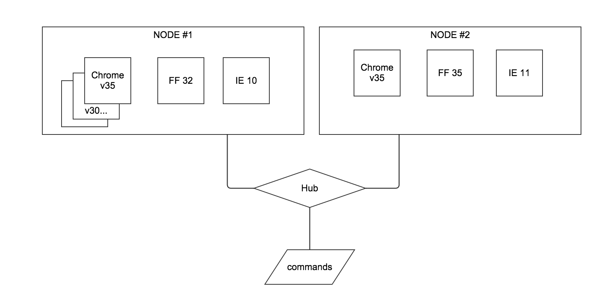

[Project description](#Project description)

[Web site analysis](#Web site analysis)

## Intro

Here in EastBanc technologies we work on very different and usually very interesting
kin of projects from relatively simple mobile apps to complex B2B portals to dynamically scalable analytics platforms etc...
It is always  a lot of things to learn and a lot of great chalenges.
Each time you assigned to a new project the very first thought is
__"wow I've never done anything like this, but I feel like I know how it should be done and I am sure It's going to be fan"__

Exactly same thought came to my mind when I started working on... building QA framework for the one of our most valuable customers - The Washington Post newspaper.

## Project description

This is a different type of QA frameworks you than might thought.
We were not going to crete a killer for JUnit nor Mockito nor even Cucumber.  
In two words the problem we needed to solve could be described like:
>"Here is our main web site, we need to make sure users always have great experience with it.
> Pages are transferred for the sane amount of time,
> they are correctly rendered and rendering is fast, layout is correct for all typical resolutions and so forth... for typical web browsers and mobile platforms"

Basically we needed to build automated acceptance testing framework,
integrate it into customers continuous integration process and provide
certain level of transparency of our work to product owner:
  the ability to review test cases, combine some of them into a test plans and run on the selected platfrom/s;

The initial plan was:

- Make web site analysis and figure out which types of automated tests could be applied; **what exactly do we need to test?**
- Tools and frameworks selection; **how can we test that?**
- Tests implementation; **test that!**
- Implement tests running infrastructure; **where all these tests will be run?**
- Implement continuous runtime for tests; **when, how often tests will run and how to see results etc...?**
- Implement an utility which would provide a transparency of our work to a customer; **It would be nice to have a test case management application**
- Integrate tests automation system with customer's exiting monitoring solution; **show test results on super cool huge displays**

Now let's briefly walk through it and see what we have built.

## Web site analysis

It is important to say that the web site is an electronic newspaper consists mainly of different types of articles and some search functionality.

Articles may contain a mix of various content types: text, photos and videos and may page may have different layout for different article type.

So for the first phase of the project we decided to test:

- Functional testing (cover various types of searches available on the website);

- Web site navigation testing;  
  e.g. after click on sidebar menu overlay is opened and it is displayed in right position

- Pages layout for most popular resolutions set (desktop, laptop, tablet, mobile);

- Most common page elements rendering validity in most popular browsers (Chrome, FF, IE11);

- External links validity;  
    Verify that all links on the page are valid (link is alive)
    Verify that requested link header is correspond to the link (link is valid)

- Social services integration; likes, sharing etc...

## Tools and frameworks

Unfortunately there is only single solution for automated testing in the browser exists - **[Selenium](http://www.seleniumhq.org/)**
available.
We say unfortunately because usually If something does not have  a competitor it is ever
something completely useless or something very specific but
fortunately not in this case because Selenium is an open source software with huge community built a bunch of tools on top of it which simplify various testing aspects like:
[Nightwatch JS](http://nightwatchjs.org/), [Galen Framework](http://galenframework.com/), [Selenide](https://github.com/codeborne/selenide) and many many more.  

There are few SAAS products build on Selenium core, we tested two of them [SauceLabs](https://saucelabs.com/), [Browserstack](http://www.browserstack.com/).
Both provide trial so you can feel the power of automated testing without installing anything anywhere.

All these convinced  that Selenium became mature de facto solution in browser automation world.

Basically Selenium is set of three components: web driver, node and hub.

- **Web driver** is a automation API implementation for particular browser;
- **Node** - node is aware of which types of browsers and theirs versions are available on the machine, interact with the **hub** and translate commands to **web drivers**;
- **Hub** - organizes nodes into cluster; collect information about nodes capabilities and manages requests between nodes.

**Picture 1**. Simple two-nodes selenium cluster

### General automation

### Rendering testing

// todo galen

### Layout testing

 // todo galen
